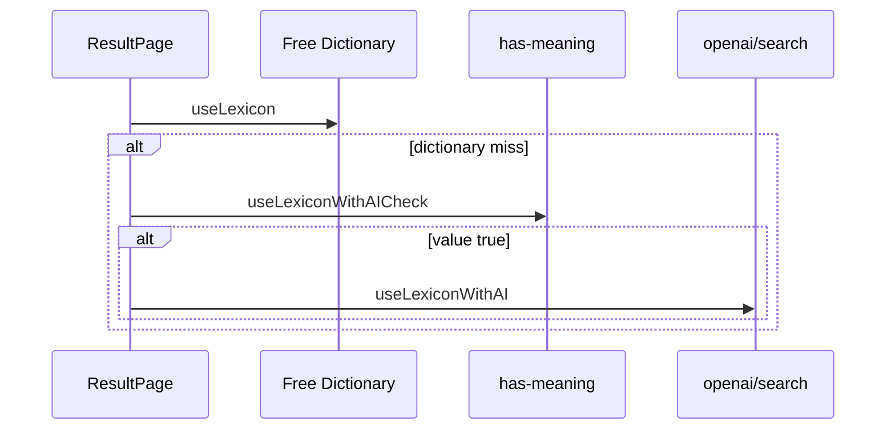

# Plan 032: Spike — wire has-meaning gate before full AI

> **Executor instructions**: This is a **design/spike plan**, not a full build. Produce a short decision doc and optional prototype PR scope. Do not delete has-meaning code (conflicts with plan 025). Update status in `plans/README.md` when spike completes.
>
> **Drift check (run first)**: `git diff --stat 89e2ecb..HEAD -- src/components/organisms/ResultPage/index.tsx src/hooks/use-lexicon.tsx src/app/api/openai/search/has-meaning/route.ts`

## Status

- **Priority**: P2
- **Effort**: S (spike)
- **Risk**: LOW
- **Depends on**: plans/007-verification-baseline.md, plans/010-openai-error-responses.md
- **Category**: direction
- **Planned at**: commit `89e2ecb`, 2026-06-18
- **Findings**: DIRECTION-02 (coordinates with DEBT-01 / plan 025)

## Why this matters

Full AI search (`/api/openai/search`) is expensive vs boolean `has-meaning` check. Wiring the gate could skip AI for gibberish queries and reduce cost. Dead code exists today — product must decide: **wire** or **delete** (plan 025).

## Current state

Flow today (`ResultPage/index.tsx:146-147`):
```
dictionary empty → useLexiconWithAI(word)  // full definition
```

Unused gate stack: `has-meaning` route, `useLexiconWithAICheck`, `hasDefinition` util.

## Commands you will need

| Purpose | Command | Expected |
|---------|---------|----------|
| Build   | `pnpm build` | exit 0 |

## Scope

**In scope**:
- Write `plans/spikes/032-has-meaning-gate-decision.md` (create) with:
  - Option A: Wire gate — sequence diagram, latency estimate (2 OpenAI calls vs 1)
  - Option B: Delete stack — reference plan 025
  - Recommendation
- Optional: ≤50 line prototype behind flag `NEXT_PUBLIC_AI_GATE=true` (only if operator approves)

**Out of scope**:
- Production enablement without review
- Rate limit design (plan 016)

## Git workflow

- Branch: `advisor/032-has-meaning-spike`
- Deliverable is markdown decision, not necessarily code

## Steps

### Step 1: Document current vs proposed flow



### Step 2: Cost/latency analysis

- has-meaning: `max_completion_tokens: 10`
- full search: `max_completion_tokens: 1000`
Note double latency if sequential.

### Step 3: Decision + follow-up plan reference

If wire → create implementation plan or expand this to full build.
If delete → mark plan 025 TODO, this spike DONE.

## Test plan

- Spike only — no test requirement unless prototype shipped

## Done criteria

- [ ] Decision doc exists with clear recommendation
- [ ] Plan 025 status updated (blocked or unblocked) in README
- [ ] `plans/README.md` row 032 → DONE

## STOP conditions

- Operator already decided delete — mark DONE with "delete" recommendation only.

## Maintenance notes

- If wired, update plan 016 rate limits for both endpoints sharing budget.
