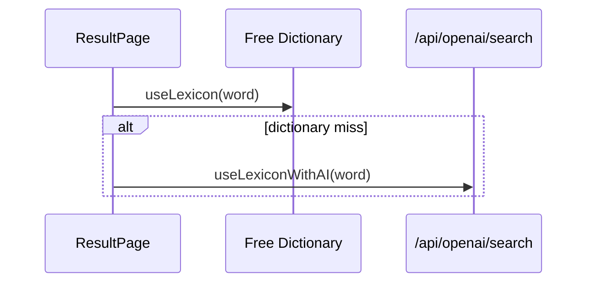
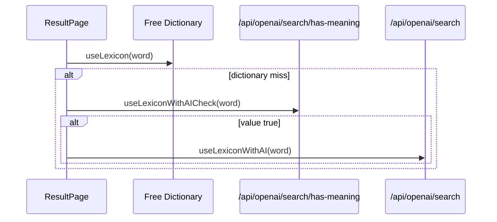

# Plan 032 decision: has-meaning gate

## Current flow

The unused stack is:

- `src/app/api/openai/search/has-meaning/route.ts`
- `useLexiconWithAICheck` in `src/hooks/use-lexicon.tsx`
- `hasDefinition` in `src/utils/index.ts`
- `OPENAI_MEANING_CHECK_API` in `src/constants/index.ts`

## Option A: wire the gate

Pros:

- Can skip full AI generation for obvious gibberish.
- Uses only `max_completion_tokens: 10` for the pre-check.

Cons:

- Meaningful dictionary misses now need two sequential OpenAI calls instead of one.
- Users wait for the gate before the full definition starts.
- The endpoint needs its own product semantics, rate budget, tests, and UI error handling.

## Option B: delete the stack

Pros:

- Removes an unauthenticated OpenAI endpoint from the public surface.
- Keeps dictionary miss behavior simple: one fallback call, one loading state.
- Reduces maintenance around duplicate prompts, route tests, and hook types.

Cons:

- Gibberish queries may still reach full AI fallback.
- If the product later wants an explicit "can AI answer this?" preflight, this stack must be rebuilt.

## Recommendation

Delete the stack now and keep plan 025 unblocked.

The current product behavior is a direct dictionary-first fallback. A sequential boolean gate optimizes for a narrow cost case but worsens latency for legitimate phrases and idioms, which are core Lexicons use cases. Cost control is already better handled by plan 016 rate limiting and plan 014 schema alignment.

## Follow-up

- Run plan 025 to remove the route, hook, util, constant, and tests.
- If AI modes become explicit product surfaces later, design the preflight as part of that mode flow rather than a silent fallback gate.
